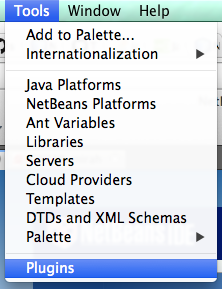
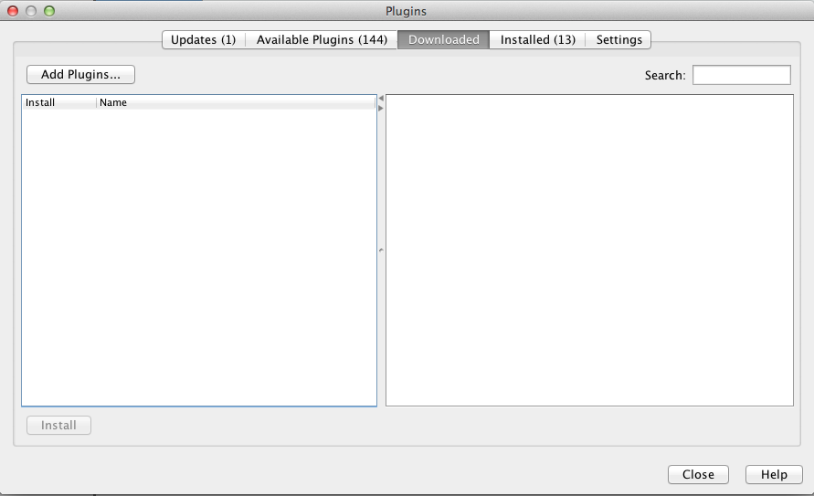
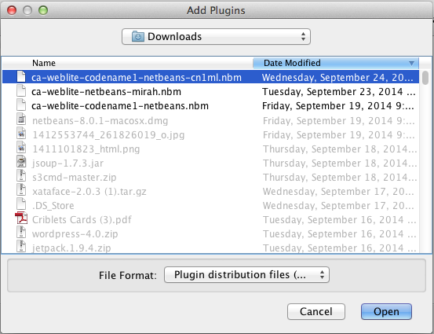
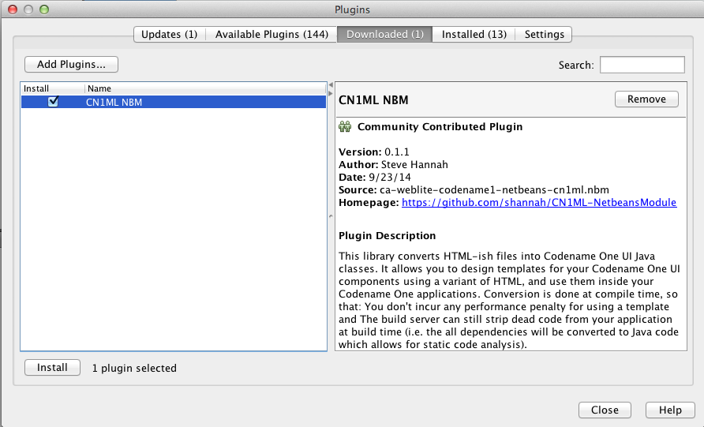
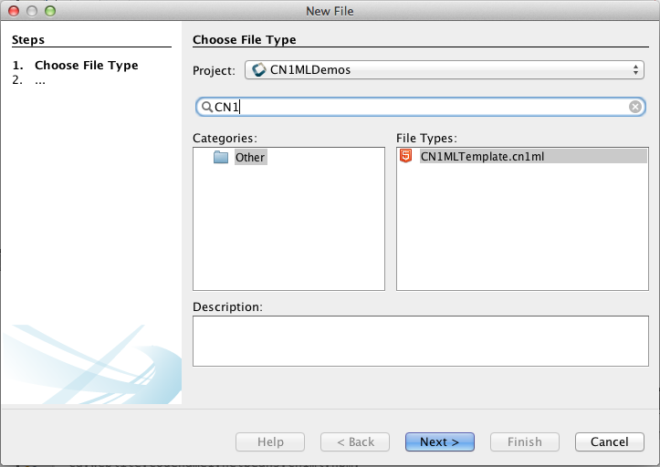
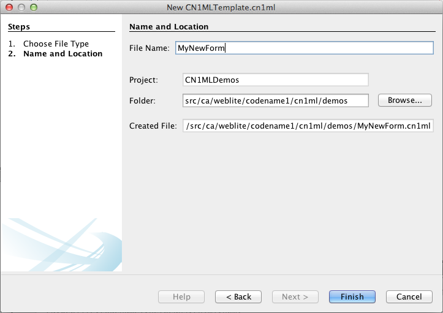
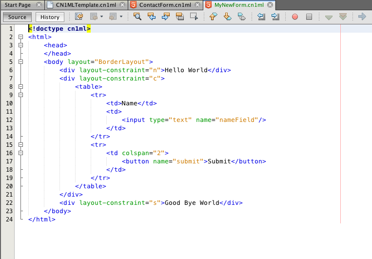
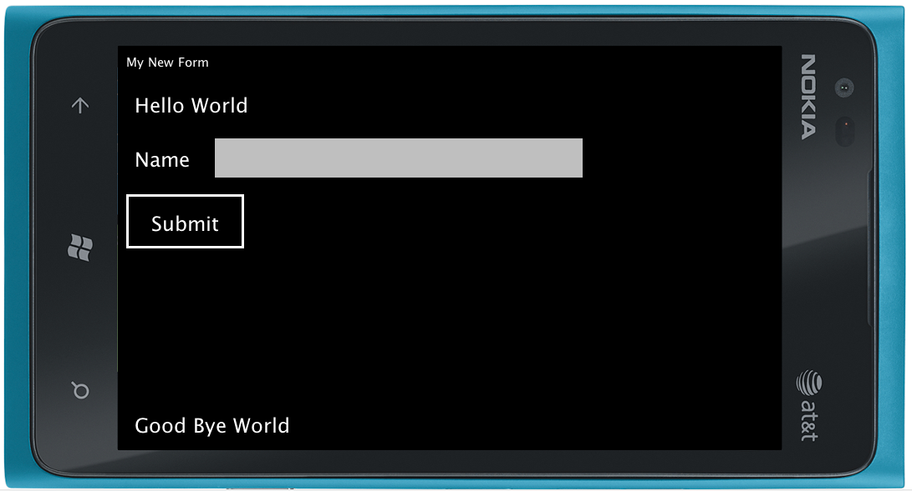

#CN1ML NetBeans Module

##Codename One Templates using HTML

##Contents

1. [Synopsis](#synopsis)
2. [Motivation](#motivation)
3. [License](#license)
4. [Installation](#installation)
5. [Usage](#usage)
	1. [Creating a New Template](#creating-a-new-template)
	2. [Using The Template From Java](#using-the-template-from-java)
6. [Samples](#more-samples)

##Synopsis

This library converts HTML-ish files into Codename One UI Java classes.  It allows you to design templates for your Codename One UI components using a variant of HTML, and use them inside your Codename One applications.

Conversion is done at compile time, so that:

1. You don't incur any performance penalty for using a template and
2. The build server can still strip dead code from your application at build time (i.e. the all dependencies will be converted to Java code which allows for static code analysis).

##Motivation

Codename One already has a fantastic WYSIWYG GUI builder.  Why is this even necessary?  In fact the resource files edited and generated by the GUI builder can be exported to XML.  So why bother with this templating library?

I created this library because sometimes I want to express my UI structure using code or text.  The XML produced by the resource editor is not meant to be edited by humans.  Using Java directly to describe a component hierarchy quickly turns into a mess that is difficult to maintain.  I wanted a format that was simple to be hand-coded, and provided a simple birds-eye view of the UI component hierarchy.

##Features

1. Seamlessly compiles to actual Java class so there is no runtime performance penalty.
2. Express any Codename One UI component hierarchy declaratively using HTML.
3. Support for any layouts.
4. Advanced table support, including `colspan` and `rowspan` support.
5. Direct mapping of most HTML input types to corresponding UI Component type.  E.g. `<input type="text"/>` to `TextField`, and `<textarea>` to `TextArea`, etc..
6. Support for Lists and ComboBoxes using `<select>` tag.
7. `uiid` and client property support via `data-<property name>` attributes.
8. Support for Images via the `` tag, referencing either the resource file or the classpath.
9. `<script>` tag support to embed Java directly in template if you need to perform custom initialization or decoration.
10. Ability to pass data to the template for use inside `<script>` tags and attributes.
11. Designed to be editable and readable by humans.

##License

[Apache 2.0](http://www.apache.org/licenses/LICENSE-2.0.txt)

##Installation

1. Download the [CN1ML Netbeans Module](https://s3.amazonaws.com/download.weblite.ca/cn1ml-nbm/ca-weblite-codename1-netbeans-cn1ml.nbm)
2. Open Netbeans, and select "Tools" > "Plugins"
	
	
	
3. In the "Plugins" dialog, select the "Downloaded" tab, and click the "Add Plugins..." button.

	

4. In the file chooser, navigate to and select the "ca-weblite-codename1-netbeans-cn1ml.nbm" file that you downloaded in step one.

	

5. Make sure the CN1ML NBM module is listed in the "Plugins" dialog and that its checkbox is checked.  Then click the "Install" button.
	
	
	
6. Follow the prompts and restart the IDE when asked.

##Usage

###Creating a New Template

1. Inside your Codename One Netbeans project, add a new file (of type CN1MLTemplate) somewhere inside the src directory.  The placement of this file will dictate where its corresponding Java class will be saved.  E.g. If you want your UI form to be accessible as the Java class `com.mycompany.MyForm`, then you should place this new file inside the `com.mycompany` package.   In the "New File" dialog, you can either filter for "CN1ML", or select the "Other" category to see the CN1MLTemplate file type as shown below:
  
2. Click "Next"
3. For the "File Name" you should specify the name that you would like the resulting Java class to be.  E.g. If you want the Java class to be `com.mycompany.MyNewForm`, then enter "MyNewForm" for the file name.
  
4. Click "Finish"

This should create a new file named "MyNewForm.cn1ml" inside the package.  It will also create an associated file "MyNewForm.java" in the same package.  This is the class that is automatically generated by the CN1ML template.  It will automatically be regenerated whenever the MyNewForm.cn1ml file is saved.

**(In the above screenshot, only two of those files exist as a result of our new file.  The rest were already there in my existing project)**

The CN1ML template initially starts out with some sample content to give you an idea of some of what the syntax is like.  

Before proceeding, let's take a look at the contents of the "MyNewForm.cn1ml" file and compare it to the "MyNewForm.java" file that was generated.

**MyNewForm.cn1ml:**

~~~
<!doctype cn1ml>
<html>
    <head>
    </head>
    <body layout="BorderLayout">
        
Hello World

        

            <table>
                <tr>
                    <td>Name</td>
                    <td>
                        <input type="text" name="nameField"/>
                    </td>
                </tr>
                <tr>
                    <td colspan="2">
                        <button name="submit">Submit</button>
                    </td>
                </tr>
            </table>
        

        
Good Bye World

    </body>
</html>

~~~

**MyNewForm.java:**

~~~
/* THIS FILE IS AUTOMATICALLY GENERATED-- DO NOT MODIFY IT*/
package ca.weblite.codename1.cn1ml.demos;

import com.codename1.ui.*;
import com.codename1.ui.layouts.*;
import com.codename1.ui.table.*;
import com.codename1.ui.util.*;

class MyNewForm {

    private Container rootContainer;
    private Resources resources;

    public Container getRoot() {
        if (rootContainer == null) {
            try {
                rootContainer = buildUI();
            } catch (Exception ex) {
                ex.printStackTrace();
                throw new RuntimeException(ex.getMessage());
            }
        }
        return rootContainer;
    }
    private java.util.Map<String, Component> _nameIndex = new java.util.HashMap<String, Component>();

    public Component get(String name) {
        getRoot();
        return _nameIndex.get(name);
    }

    public MyNewForm(java.util.Map context) {
        for (Object o : context.values()) {
            if (o instanceof Resources) {
                resources = (Resources) o;
            }
        }
    }

    private Container buildUI() throws Exception {
        Container root = new Container();
        BorderLayout rootLayout = new BorderLayout();
        root.setLayout(rootLayout);
        Container node1 = new Container();
        FlowLayout node1Layout = new FlowLayout();
        node1.setLayout(node1Layout);
        node1.addComponent(new Label("Hello World"));
        if (root != node1.getParent()) {
            root.addComponent(BorderLayout.NORTH, node1);
        }
        Container node2 = new Container();
        FlowLayout node2Layout = new FlowLayout();
        node2.setLayout(node2Layout);
        Container node3 = new Container();
        TableLayout node3Layout = new TableLayout(2, 2);
        node3.setLayout(node3Layout);
        Container node4 = new Container();
        FlowLayout node4Layout = new FlowLayout();
        node4.setLayout(node4Layout);
        init1_node4(node4, node3);
        node4.addComponent(new Label("Name"));
        if (node3 != node4.getParent()) {
            node3.addComponent(node4);
        }
        Container node5 = new Container();
        FlowLayout node5Layout = new FlowLayout();
        node5.setLayout(node5Layout);
        init2_node5(node5, node3);
        TextField node6 = new TextField();
        node6.setName("nameField");
        _nameIndex.put("nameField", node6);
        if (node5 != node6.getParent()) {
            node5.addComponent(node6);
        }
        if (node3 != node5.getParent()) {
            node3.addComponent(node5);
        }
        Container node7 = new Container();
        FlowLayout node7Layout = new FlowLayout();
        node7.setLayout(node7Layout);
        init3_node7(node7, node3);
        Button node8 = new Button();
        node8.setName("submit");
        _nameIndex.put("submit", node8);
        node8.setText("Submit");
        if (node7 != node8.getParent()) {
            node7.addComponent(node8);
        }
        if (node3 != node7.getParent()) {
            node3.addComponent(node7);
        }
        if (node2 != node3.getParent()) {
            node2.addComponent(node3);
        }
        if (root != node2.getParent()) {
            root.addComponent(BorderLayout.CENTER, node2);
        }
        Container node9 = new Container();
        FlowLayout node9Layout = new FlowLayout();
        node9.setLayout(node9Layout);
        node9.addComponent(new Label("Good Bye World"));
        if (root != node9.getParent()) {
            root.addComponent(BorderLayout.SOUTH, node9);
        }
        return root;
    }

    private void init1_node4(Container self, Container parent) {
        TableLayout l = (TableLayout) parent.getLayout();
        TableLayout.Constraint c = l.createConstraint(0, 0);
        c.setVerticalSpan(1);
        c.setHorizontalSpan(1);
        parent.addComponent(c, self);
    }

    private void init2_node5(Container self, Container parent) {
        TableLayout l = (TableLayout) parent.getLayout();
        TableLayout.Constraint c = l.createConstraint(0, 1);
        c.setVerticalSpan(1);
        c.setHorizontalSpan(1);
        parent.addComponent(c, self);
    }

    public TextField getNameField() {
        return (TextField) get("nameField");
    }

    private void init3_node7(Container self, Container parent) {
        TableLayout l = (TableLayout) parent.getLayout();
        TableLayout.Constraint c = l.createConstraint(1, 0);
        c.setVerticalSpan(1);
        c.setHorizontalSpan(2);
        parent.addComponent(c, self);
    }

    public Button getSubmit() {
        return (Button) get("submit");
    }
}

~~~

**Observations:**

* Even with this simple example, it is clear that the HTML version is *way* more readable than the resulting code.
* The HTML DOM has been transformed into a Codename One component hierarchy with the `<body>` tag mapping to a `com.codename1.ui.Container` instance which is accessible via the `getRoot()` method.  `
` tags are generally transformed to `Container` objects, and HTML `<input>` tags are mapped to the corresponding Component type (e.g. "text" -> `TextField`).
* Accessor methods have been generated for all elements that include a "name" attribute (e.g. `getSubmit()`).
* `<table>` tags are transformed into a `Container` with a `TableLayout` layout, and `<td>` tags transformed into `Container`s with appropriate `TableLayout.Constraint` constraints so that they behave as you would expect of a table.
* **This is just a very basic example**

###Using The Template From Java

The `MyNewForm` class can now be used like any other Java class in your Codename One application.  Here is a simple example:

~~~

	 private void showMyNewForm(){
        
		 // Instantiate the MyNewForm class.
		 // Takes a Map in the constructor as a means of passing data to the
		 // template.
		 MyNewForm f = new MyNewForm(new HashMap());
		 
		 // Create a new form to show our template
		 Form form = new Form("My New Form");
		 form.setLayout(new BorderLayout());
		 
		 // Add the MyNewForm to the form.
		 // Use the getRoot() method to get the root container 
		 // corresponding to the <body> tag.
		 form.addComponent(BorderLayout.CENTER, f.getRoot());
		 
		 // Show the form
		 form.show();
    }
~~~

When, run in the simulator with the Lumia skin, this example looks like:

##More Samples

1. [A Simple List](docs/samples/List.md)
2. [A Contact Form](docs/samples/ContactForm.md)
3. [A Map](docs/samples/Map.md)
4. [An embedded Web Browser](docs/samples/WebBrowser.md)
5. [A Main Menu](docs/samples/MainMenu.md)
6. [Images Example](docs/samples/ImagesExample.md)
