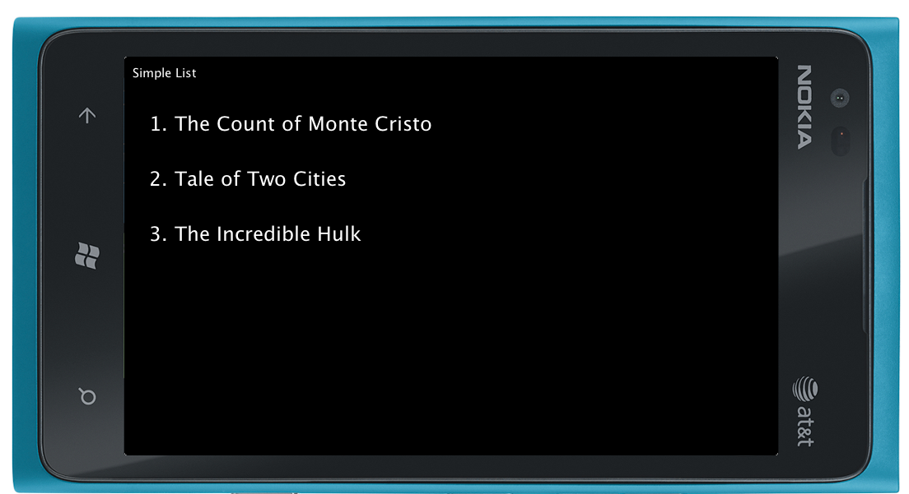
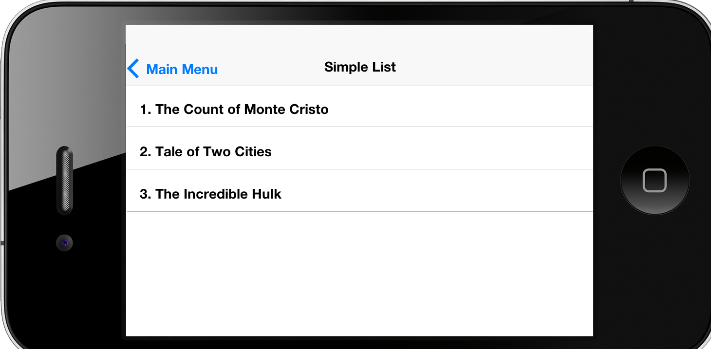

## CN1ML Sample: A Simple List

[Return to Samples](../../README.md#samples)

This sample is part of the [CN1MLDemos](../../CN1MLDemos) project.  It demonstrates how to create a simple list using a `<select>` tag.  Notice that the `<select>` tag includes the `size` attribute. Without it, the list would have been rendered as a Combo Box.

In this case, the List contents are provided inside the template as `<option>` tags, however, you could also pass a reference to a context object to specify either the data or model of the list using either the `data` or `model` attribute of the `<select>` tag.  See the [Main Menu](MainMenu.md) example for a sample using the `data` attribute to specify the list contents.

### CN1ML Source:

From [SimpleList.cn1ml](../../CN1MLDemos/src/ca/weblite/codename1/cn1ml/demos/SimpleList.cn1ml)

~~~
<html>
    <head></head>
    <body layout="BorderLayout">
        <select name="bookList" size="5" layout-constraint="c">
            <option>The Count of Monte Cristo</option>
            <option>Tale of Two Cities</option>
            <option>The Incredible Hulk</option>
        </select>
    </body>
</html>
~~~

### Resulting Java Source:

From [SimpleList.java](../../CN1MLDemos/src/ca/weblite/codename1/cn1ml/demos/SimpleList.java)

~~~
/* THIS FILE IS AUTOMATICALLY GENERATED-- DO NOT MODIFY IT*/
package ca.weblite.codename1.cn1ml.demos;

import com.codename1.ui.*;
import com.codename1.ui.layouts.*;
import com.codename1.ui.table.*;
import com.codename1.ui.util.*;

class SimpleList {

    private Container rootContainer;
    private Resources resources;

    public Container getRoot() {
        if (rootContainer == null) {
            try {
                rootContainer = buildUI();
            } catch (Exception ex) {
                ex.printStackTrace();
                throw new RuntimeException(ex.getMessage());
            }
        }
        return rootContainer;
    }
    private java.util.Map<String, Component> _nameIndex = new java.util.HashMap<String, Component>();

    public Component get(String name) {
        getRoot();
        return _nameIndex.get(name);
    }

    public SimpleList(java.util.Map context) {
        for (Object o : context.values()) {
            if (o instanceof Resources) {
                resources = (Resources) o;
            }
        }
    }

    private Container buildUI() throws Exception {
        Container root = new Container();
        BorderLayout rootLayout = new BorderLayout();
        root.setLayout(rootLayout);
        List node1 = new List();
        node1.setName("bookList");
        _nameIndex.put("bookList", node1);
        init1_node1(node1, root);
        if (root != node1.getParent()) {
            root.addComponent(BorderLayout.CENTER, node1);
        }
        return root;
    }

    public List getBookList() {
        return (List) get("bookList");
    }

    private void init1_node1(List self, Container parent) {
        java.util.ArrayList opts = new java.util.ArrayList();
        opts.add("The Count of Monte Cristo");
        opts.add("Tale of Two Cities");
        opts.add("The Incredible Hulk");
        self.setModel(new com.codename1.ui.list.DefaultListModel(opts));

    }
}

~~~

### Usage

From: [CN1MLDemo.java](../../CN1MLDemos/src/ca/weblite/codename1/cn1ml/demos/CN1MLDemo.java#L102)

~~~
    private void showSimpleList(){
        SimpleList l = new SimpleList(newContext());
        createForm("Simple List", l.getRoot()).show();
    }
~~~

### Screenshots

**Lumia Skin**

**iOS Skin**

