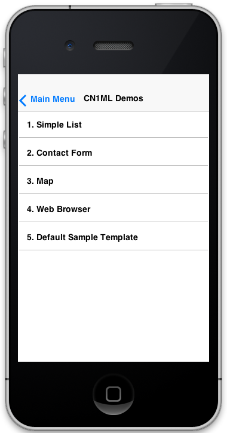

## CN1ML Sample: Main Menu

[Return to Samples](../../README.md#more-samples)

This sample is part of the [CN1MLDemos](../../CN1MLDemos) project. 

####Things to notice:

1. ***Attributes are passed to this template.***
In this example, we pass the list model data as a parameter to the template rather than hard-coding the list items in the template.  Note the `attributes` attribute on the `<body>` tag that specifies that parameters that this template accepts.  In this case we specify that the template accepts one parameter `menuItems` of type `String[]`.  These parameters are passed to the template as part of the context map parameter in the constructor:
	
	~~~
	        HashMap context = new HashMap();
	        context.put("res", theme);
	        context.put("menuItems", new String[]{
	            "Simple List",
	            "Contact Form",
	            "Map",
	            "Web Browser",
	            "Default Sample Template",
	        });
	        final MainMenu m = new MainMenu(context);
	
	~~~
	
	 This is attribute is then referenced in the "data" attribute of the `<select>` tag.

2. We use the `getMenuList()` accessor (which is generated because of the `name` attribute on the `<select>` tag) to get a reference to the list in our Java source and attach an ActionListener to it.  THis is a good example of how CN1ML templates are intended to be used.  Express the structure with HTML, but add behaviour in Java.

### CN1ML Source:

From [MainMenu.cn1ml](../../CN1MLDemos/src/ca/weblite/codename1/cn1ml/demos/MainMenu.cn1ml)

~~~
<html>
    <body layout="BorderLayout" attributes="String[] menuItems;">
        <select name="menuList" size="5" data="menuItems" layout-constraint="c"></select>
    </body>
</html>
~~~

### Resulting Java Source:

From [MainMenu.java](../../CN1MLDemos/src/ca/weblite/codename1/cn1ml/demos/MainMenu.java)

~~~
/* THIS FILE IS AUTOMATICALLY GENERATED-- DO NOT MODIFY IT*/
package ca.weblite.codename1.cn1ml.demos;

import com.codename1.ui.*;
import com.codename1.ui.layouts.*;
import com.codename1.ui.table.*;
import com.codename1.ui.util.*;

class MainMenu {

    private Container rootContainer;
    private Resources resources;

    public Container getRoot() {
        if (rootContainer == null) {
            try {
                rootContainer = buildUI();
            } catch (Exception ex) {
                ex.printStackTrace();
                throw new RuntimeException(ex.getMessage());
            }
        }
        return rootContainer;
    }
    private java.util.Map<String, Component> _nameIndex = new java.util.HashMap<String, Component>();

    public Component get(String name) {
        getRoot();
        return _nameIndex.get(name);
    }
    private String[] menuItems;

    public MainMenu(java.util.Map context) {
        menuItems = (String[]) context.get("menuItems");
        for (Object o : context.values()) {
            if (o instanceof Resources) {
                resources = (Resources) o;
            }
        }
    }

    private Container buildUI() throws Exception {
        Container root = new Container();
        BorderLayout rootLayout = new BorderLayout();
        root.setLayout(rootLayout);
        List node1 = new List();
        node1.setName("menuList");
        _nameIndex.put("menuList", node1);
        init1_node1(node1, root);
        if (root != node1.getParent()) {
            root.addComponent(BorderLayout.CENTER, node1);
        }
        return root;
    }

    public List getMenuList() {
        return (List) get("menuList");
    }

    private void init1_node1(List self, Container parent) {
        self.setModel(new com.codename1.ui.list.DefaultListModel(menuItems));

    }
}

~~~

### Usage

From: [CN1MLDemo.java](../../CN1MLDemos/src/ca/weblite/codename1/cn1ml/demos/CN1MLDemo.java)

~~~
    private Component getMainMenu(){
        HashMap context = new HashMap();
        context.put("res", theme);
        context.put("menuItems", new String[]{
            "Simple List",
            "Contact Form",
            "Map",
            "Web Browser",
            "Default Sample Template",
        });
        final MainMenu m = new MainMenu(context);
        m.getMenuList().addActionListener(new ActionListener(){

            public void actionPerformed(ActionEvent evt) {
                String sel = (String)m.getMenuList().getSelectedItem();
                if ("Simple List".equals(sel)){
                    showSimpleList();
                } else if ( "Contact Form".equals(sel)){
                    showContactForm();
                } else if ("Map".equals(sel)){
                    showMap();
                } else if ("Web Browser".equals(sel)){
                    showWebBrowser();
                } else if ("Default Sample Template".equals(sel)){
                    showMyNewForm();
                }
            }
            
        });
        
        return m.getRoot();
        
    }
    
    private void showMainMenu(){
        createForm("CN1ML Demos", getMainMenu()).show();
    }
~~~

### Screenshots

