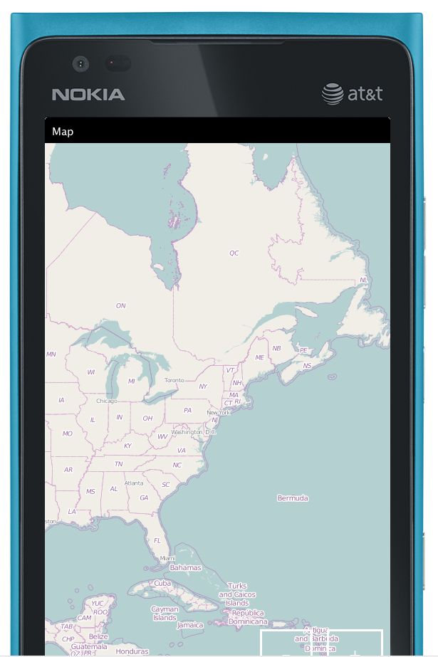

## CN1ML Sample: A Map

[Return to Samples](../../README.md#more-samples)

This sample is part of the [CN1MLDemos](../../CN1MLDemos) project. This is a bare-bones minimal example.  Notice the use of the `class` attribute on the `<body>` tag.  This attribute can be used on any tag to dictate the type of component that should be used to represent this tag in the corresponding Component hierarchy.  

### CN1ML Source:

From [Map.cn1ml](../../CN1MLDemos/src/ca/weblite/codename1/cn1ml/demos/Map.cn1ml)

~~~
<html>
    <body class="com.codename1.maps.MapComponent">
        
    </body>
</html>
~~~

Note:  We could also have done:

~~~
<html>
    <head>
    	
    </head>
    <body class="MapComponent">
        
    </body>
</html>
~~~

As `<script>` tag contents in the `<head>` are placed before the class definition in the resulting Java class, so are appropraite for providing import statements.

### Resulting Java Source:

From [Map.java](../../CN1MLDemos/src/ca/weblite/codename1/cn1ml/demos/Map.java)

~~~
/* THIS FILE IS AUTOMATICALLY GENERATED-- DO NOT MODIFY IT*/
package ca.weblite.codename1.cn1ml.demos;

import com.codename1.ui.*;
import com.codename1.ui.layouts.*;
import com.codename1.ui.table.*;
import com.codename1.ui.util.*;

class Map {

    private Container rootContainer;
    private Resources resources;

    public Container getRoot() {
        if (rootContainer == null) {
            try {
                rootContainer = buildUI();
            } catch (Exception ex) {
                ex.printStackTrace();
                throw new RuntimeException(ex.getMessage());
            }
        }
        return rootContainer;
    }
    private java.util.Map<String, Component> _nameIndex = new java.util.HashMap<String, Component>();

    public Component get(String name) {
        getRoot();
        return _nameIndex.get(name);
    }

    public Map(java.util.Map context) {
        for (Object o : context.values()) {
            if (o instanceof Resources) {
                resources = (Resources) o;
            }
        }
    }

    private Container buildUI() throws Exception {
        com.codename1.maps.MapComponent root = new com.codename1.maps.MapComponent();
        return root;
    }
}

~~~

###Usage:

From [CN1MLDemo.java](../../CN1MLDemos/src/ca/weblite/codename1/cn1ml/demos/CN1MLDemo.java)

~~~
    private void showMap(){
        Map m = new Map(newContext());
        createForm("Map", m.getRoot()).show();
    }
~~~

###Screenshots

