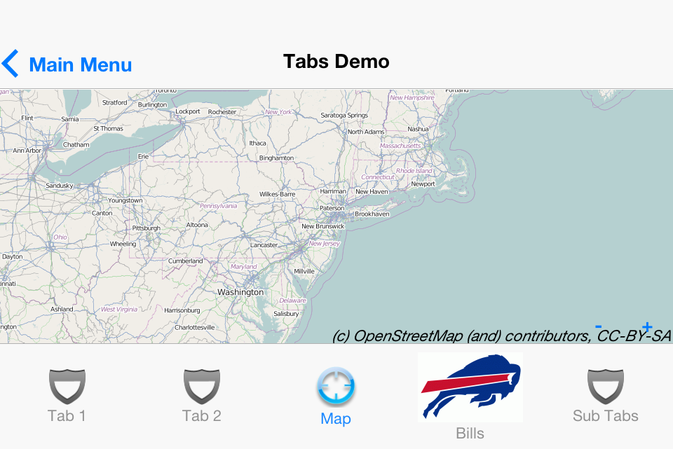

## CN1ML Sample: Tabs

[Return to Samples](../../README.md#more-samples)

This sample is part of the [CN1MLDemos](../../CN1MLDemos) project.  It shows how you can use the `Tabs` component in your application.  In this case the `Tabs` component is the root component of our template.  All child elements with the "title" attribute are added as tabs.  Notice that the child elements also support the `icon` attribute for specifying the icon to use for the tab.

Also notice the use of the `tabs` element to demonstrate that you can nest tabs in your component hierarchy (although this is not generally a good idea from a UX standpoint).

## CN1ML Source:

From [TabsDemo.cn1ml](../../CN1MLDemos/src/ca/weblite/codename1/cn1ml/demos/TabsDemo.cn1ml)

~~~
<!doctype cn1ml>
<html>
    <head>
    </head>
    <body class="Tabs">
        

            Hello
        

        

            World
        

        

            
        

        

            This is the Bills Page
        

        <tabs title="Sub Tabs">
            

                In subtab 1
            

            

                In Subtab 2
            

        </tabs>
    </body>
</html>

~~~

### Resulting Java Source:

From [TabsDemo.java](../../CN1MLDemos/src/ca/weblite/codename1/cn1ml/demos/TabsDemo.java)

~~~

/* THIS FILE IS AUTOMATICALLY GENERATED-- DO NOT MODIFY IT*/
package ca.weblite.codename1.cn1ml.demos;

import com.codename1.ui.*;
import com.codename1.ui.layouts.*;
import com.codename1.ui.table.*;
import com.codename1.ui.util.*;

class TabsDemo {

    private Container rootContainer;
    private Resources resources;

    public Container getRoot() {
        if (rootContainer == null) {
            try {
                rootContainer = buildUI();
            } catch (Exception ex) {
                ex.printStackTrace();
                throw new RuntimeException(ex.getMessage());
            }
        }
        return rootContainer;
    }
    private java.util.Map<String, Component> _nameIndex = new java.util.HashMap<String, Component>();

    public Component get(String name) {
        getRoot();
        return _nameIndex.get(name);
    }

    public TabsDemo(java.util.Map context) {
        for (Object o : context.values()) {
            if (o instanceof Resources) {
                resources = (Resources) o;
            }
        }
    }

    private Container buildUI() throws Exception {
        Tabs root = new Tabs();
        Container node1 = new Container();
        FlowLayout node1Layout = new FlowLayout();
        node1.setLayout(node1Layout);
        node1.addComponent(new Label(" Hello "));
        init1_node1(node1, root);
        if (node1.getClientProperty("__CN1ML_NO_ADD__") == null && root != node1.getParent()) {
            root.addComponent(node1);
        }
        Container node2 = new Container();
        FlowLayout node2Layout = new FlowLayout();
        node2.setLayout(node2Layout);
        node2.addComponent(new Label(" World "));
        init2_node2(node2, root);
        if (node2.getClientProperty("__CN1ML_NO_ADD__") == null && root != node2.getParent()) {
            root.addComponent(node2);
        }
        com.codename1.maps.MapComponent node3 = new com.codename1.maps.MapComponent();
        init3_node3(node3, root);
        init4_node3(node3, root);
        if (node3.getClientProperty("__CN1ML_NO_ADD__") == null && root != node3.getParent()) {
            root.addComponent(node3);
        }
        Container node4 = new Container();
        FlowLayout node4Layout = new FlowLayout();
        node4.setLayout(node4Layout);
        node4.addComponent(new Label(" This is the Bills Page "));
        init5_node4(node4, root);
        if (node4.getClientProperty("__CN1ML_NO_ADD__") == null && root != node4.getParent()) {
            root.addComponent(node4);
        }
        Tabs node5 = new Tabs();
        Container node6 = new Container();
        FlowLayout node6Layout = new FlowLayout();
        node6.setLayout(node6Layout);
        node6.addComponent(new Label(" In subtab 1 "));
        init6_node6(node6, node5);
        if (node6.getClientProperty("__CN1ML_NO_ADD__") == null && node5 != node6.getParent()) {
            node5.addComponent(node6);
        }
        Container node7 = new Container();
        FlowLayout node7Layout = new FlowLayout();
        node7.setLayout(node7Layout);
        node7.addComponent(new Label(" In Subtab 2 "));
        init7_node7(node7, node5);
        if (node7.getClientProperty("__CN1ML_NO_ADD__") == null && node5 != node7.getParent()) {
            node5.addComponent(node7);
        }
        init8_node5(node5, root);
        if (node5.getClientProperty("__CN1ML_NO_ADD__") == null && root != node5.getParent()) {
            root.addComponent(node5);
        }
        return root;
    }

    private void init1_node1(Container self, Tabs parent) {
        parent.addTab("Tab 1", self);
        self.putClientProperty("__CN1ML_NO_ADD__", "NO_ADD");

    }

    private void init2_node2(Container self, Tabs parent) {
        parent.addTab("Tab 2", self);
        self.putClientProperty("__CN1ML_NO_ADD__", "NO_ADD");

    }

    private void init3_node3(com.codename1.maps.MapComponent self, Tabs parent) {

        self.zoomIn();
        self.zoomIn();

    }

    private void init4_node3(com.codename1.maps.MapComponent self, Tabs parent) {
        parent.addTab("Map", self);
        self.putClientProperty("__CN1ML_NO_ADD__", "NO_ADD");

    }

    private void init5_node4(Container self, Tabs parent) {
        parent.addTab("Bills", resources.getImage("bills.gif"), self);
        self.putClientProperty("__CN1ML_NO_ADD__", "NO_ADD");

    }

    private void init6_node6(Container self, Tabs parent) {
        parent.addTab("Subtab 1", self);
        self.putClientProperty("__CN1ML_NO_ADD__", "NO_ADD");

    }

    private void init7_node7(Container self, Tabs parent) {
        parent.addTab("subtag 2", self);
        self.putClientProperty("__CN1ML_NO_ADD__", "NO_ADD");

    }

    private void init8_node5(Tabs self, Tabs parent) {
        parent.addTab("Sub Tabs", self);
        self.putClientProperty("__CN1ML_NO_ADD__", "NO_ADD");

    }
}

~~~

###Usage:

From [CN1MLDemo.java](../../CN1MLDemos/src/ca/weblite/codename1/cn1ml/demos/CN1MLDemo.java)

~~~
    private void showTabsDemo(){
        TabsDemo f = new TabsDemo(newContext());
        createForm("Tabs Demo", f.getRoot()).show();
    }
~~~

###Screenshots

